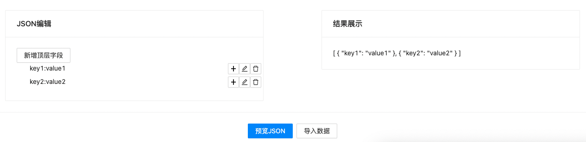
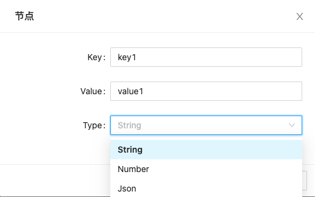
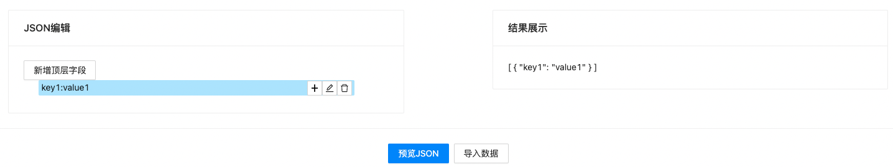
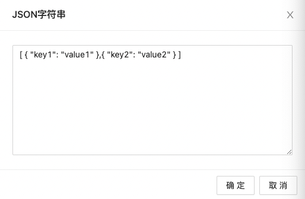
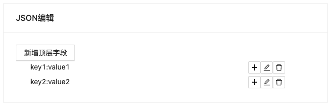

有这么一个需求，需要用户自定义Json数据。简单的想，就是一个输入框，把数据粘进去就行。但有些用户可能不了解Json的用法，交互式编辑功能可能就会有些用处。所以就有了这个Json编辑器。

编辑器默认输出的是Json数组，`新增顶层字段`是在数组中增加一组Json

###### 新增顶层字段

可以新增三种类型value: string``,`number`,`json`

已有属性可以`新增`、`编辑`，`删除`属性

选择`预览JSON`，右侧结果展示区域会显示最终生成的数据

对于希望直接粘贴数据的用户，可以选择`导入数据`，解析成功后将展示在左侧编辑区

